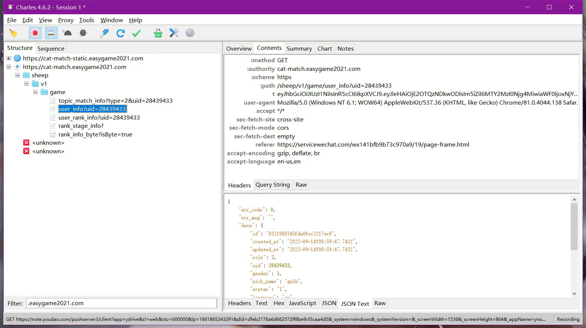
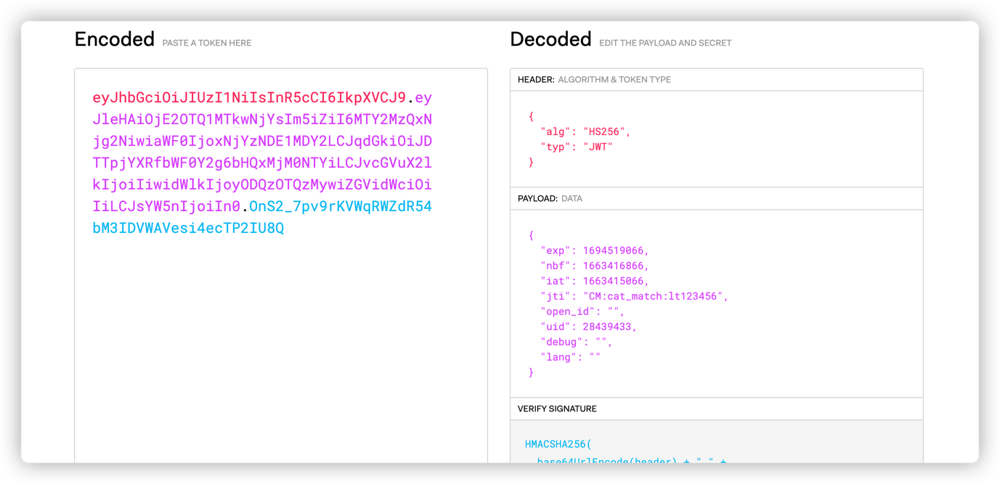
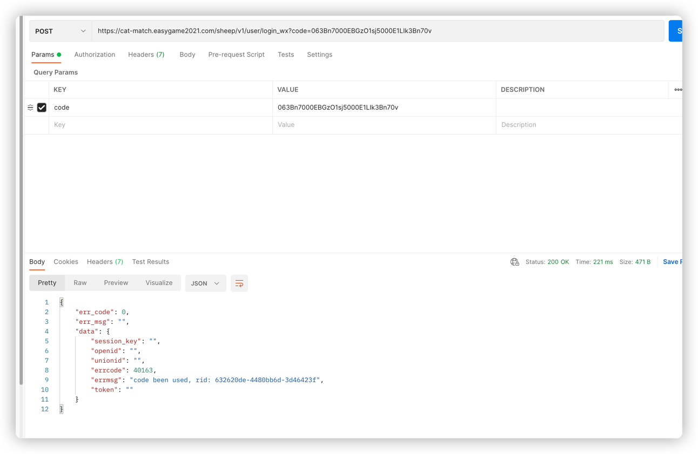
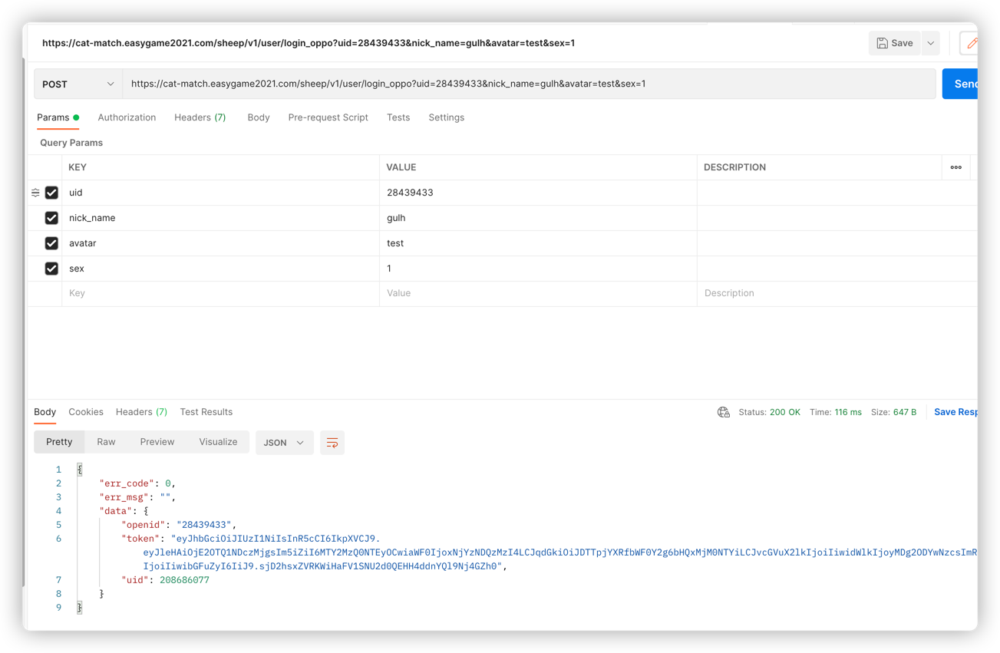

# 羊了个羊 sheep
羊了个羊 无需抓包一键通关，教程以及 前端源码与接口分析

# 教程

1.打开微信羊了个羊小游戏


2.复制头像下面的uid

3.输入到网页端的UID 输入框

4.点击获取token（如果获取不到，可以参考下面抓包教程）

5.设置入群次数

6选择游戏模式

7.输入每局次数（选填，为空则随机）

8.点击一键入群按钮


# 抓包教程

1.选择Charles或者Fiddler 等抓包软件

2.以Charles为例，软件的教程可以参考https://blog.csdn.net/Ronychen/article/details/115345293

3.微信最好选择3.5以下的，最新的版本好像对抓包工具屏蔽了

4.启动Charles，过滤域名：easygame2021.com，然后启动小游戏



上面是请求头，下面是响应

t就是要用到的jwt token，里面包含一些uid，过期时间等等



# 关于反编译小程序

反编译小程序就是把小程序wxapkg包反编译成js，html的格式，不过js基本都是混淆的，阅读起来比较困难

工具：https://github.com/Ryan-Miao/wxappUnpacker

教程：https://blog.csdn.net/wapqke/article/details/118312263


# 接口漏洞

微信小程序的登录流程大致就是

1.小程序启动。

 2.小程序通过wx.login获取微信的 code，然后将这个 code 发送给开发者服务器（我们自己的开发服务器） 

3.开发者服务器接收到code 之后，小程序服务端拿到code去微信服务器换取获取真正需要的微信用户的登录态session_key和 openid 和 unionid。

通过读源码以及抓包，分析羊了个羊的微信登录(/sheep/v1/user/login_wx")，前面的登录流程都一样，后面拿到openId时，会吧这个openId存到开发者服务器，去注册用户，然后通过开发者服务器用户的uid，秘钥生成jwt 的token，过期时间大致为1年，返回给小程序，吧token存入微信小程序的localStorage，然后就一致从本地缓存拿这个token。如果再用code请求这个接口，会报这个code已经被使用了，应该是为了防止被人恶意请求token



不过有两个接口还是可以拿到token的(/sheep/v1/user/login_oppo和/sheep/v1/user/login_tourist)



可以通过openid去请求数据，然后就可以用这个token去请求游戏的业务数据了


### 免责声明

1. 本仓库发布的项目中涉及的任何脚本，仅用于测试和学习研究，禁止用于商业用途，不能保证其合法性，准确性，完整性和有效性，请根据情况自行判断。
2. 本项目内所有资源文件，禁止任何公众号、自媒体进行任何形式的转载、发布，禁止直接改项目名二次发布。
3. 作者对任何脚本问题概不负责，包括但不限于由任何脚本错误导致的任何损失或损害.
4. 请勿将本项目的任何内容用于商业或非法目的，否则后果自负。
5. 如果任何单位或个人认为该项目的脚本可能涉嫌侵犯其权利，则应及时通知并提供身份证明，所有权证明，我们将在收到认证文件后删除相关脚本。
6. 以任何方式查看此项目的人或直接或间接使用本项目的任何脚本的使用者都应仔细阅读此声明。作者保留随时更改或补充此免责声明的权利。一旦使用并复制了任何相关脚本或本项目，则视为您已接受此免责声明。
7. 您必须在下载后的24个小时之内，从您的电脑或手机中彻底删除上述内容。
8. 本项目遵循GPL-3.0 License协议，如果本特别声明与GPL-3.0 License协议有冲突之处，以本特别声明为准。
9. 任何擅自改变计算机信息网络数据属于违法行为，本项目不提供成品可运行程序，仅做学习研究使用。

```
您使用或者复制了本仓库且本人制作的任何代码或项目，则视为已接受此声明，请仔细阅读。
```
